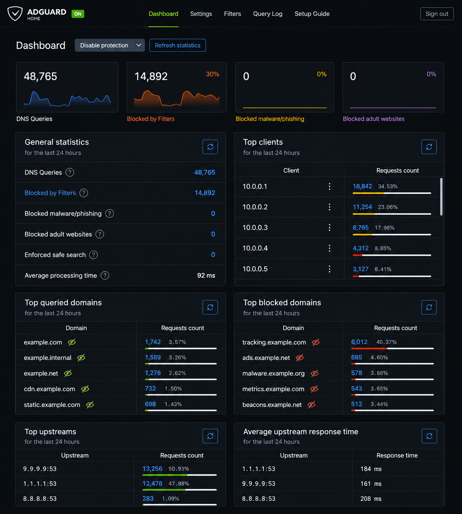
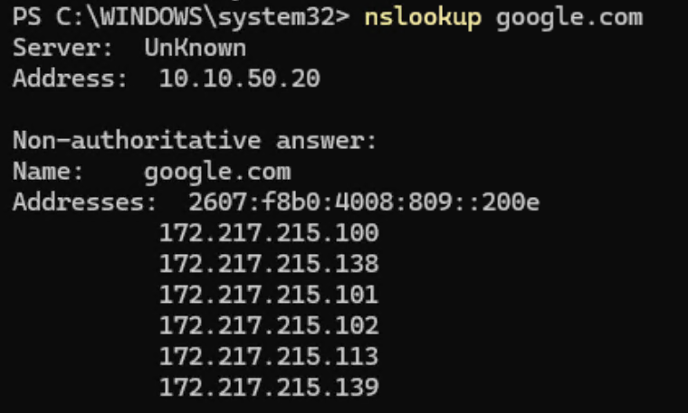
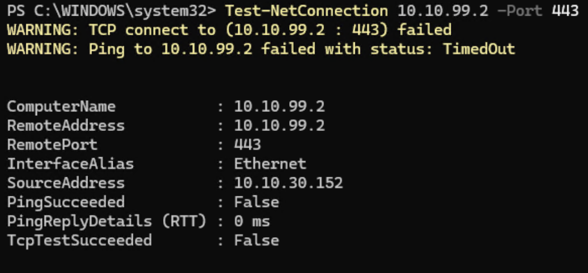

Enterprise Network Segmentation
Overview
This project documents the design and implementation of an enterprise-style segmented network built within a home lab environment using pfSense, Proxmox VE, Active Directory, managed switching, and centralized DNS services.
The objective was to reduce attack surface, isolate device trust levels, improve operational visibility, and create a scalable infrastructure platform capable of supporting enterprise services such as Active Directory, certificate-based authentication, centralized logging, and security monitoring.

 
 

 
 

Project Summary:

 
 

Designed and implemented a fully segmented enterprise network featuring:

 
 

    - 7 isolated VLANs
    - Dedicated management network
    - Centralized DNS filtering with AdGuard Home
    - Firewall-controlled inter-VLAN routing
    - Active Directory integration
    - Enterprise wireless architecture
    - Infrastructure prepared for Security Onion deployment
    - Documentation-driven design and implementation

 
 

Architecture Diagram

 
 

Homelab Topology

 
 

 
 

Architecture Highlights

 
 

Network Segmentation

 
 

Implemented VLAN-based isolation to separate:

 
 

    - Trusted Devices
    - IoT Devices
    - Guest Devices
    - Lab Systems
    - Server Infrastructure
    - Management Systems
    - Unused/Sink Ports

 
 

This approach reduces lateral movement opportunities and follows common enterprise security practices.

 
 

Management Plane Protection

 
 

Created a dedicated management network to isolate administrative services from user traffic.

 
 

Protected systems include:

 
 

    - pfSense Firewall
    - Managed Switch
    - Access Point
    - Proxmox Hypervisor
    - Infrastructure Management Services

 
 

Centralized DNS

 
 

Implemented AdGuard Home as the centralized DNS platform providing:

 
 

    - DNS filtering
    - DNS logging
    - Malware domain protection
    - Ad blocking
    - Improved troubleshooting visibility

 
 

Infrastructure Services

 
 

The segmented architecture supports:

 
 

    - Active Directory
    - DNS Services
    - Certificate Services
    - Monitoring Platforms
    - Virtualization Infrastructure
    - Future Security Onion Deployment

 
 

VLAN Design

 
 

| VLAN | Name | Purpose |
|------|------|----------|
| 10 | Orion | Trusted devices |
| 20 | Andromeda | IoT devices |
| 30 | Atlas | Lab systems |
| 40 | Pegasus | Guest access |
| 50 | Cassiopeia | Servers |
| 99 | Draco | Management |
| 999 | Blackhole | Unused/Sink VLAN |

 
 

Skills Demonstrated

 
 

Domain	Technologies & Concepts
Networking	VLAN Design, Trunking, Inter-VLAN Routing
Security	Network Segmentation, Firewall Policy Design
Infrastructure	pfSense, Proxmox VE, Active Directory
DNS	AdGuard Home, DNS Architecture
Virtualization	Hypervisor Administration, VM Networking
Documentation	Infrastructure Design Documentation
Operations	Troubleshooting, Change Management

 
 

Technologies Used

 
 

Core Infrastructure

 
 

    - pfSense Plus
    - Proxmox VE
    - Dell Precision 7810
    - MokerLink Managed 10G Switch
    - Enterprise Wireless Access Point

 
 

Identity & Authentication

 
 

    - Active Directory
    - DNS
    - DHCP

 
 

Security

 
 

    - VLAN Segmentation
    - Firewall Rules
    - DNS Filtering
    - Management Network Isolation

 
 

Future Platform Integrations
 
 

    - Security Onion
    - WPA3 Enterprise
    - Certificate-Based Authentication
    - Centralized Logging
    - Monitoring and Alerting

 
 

Configuration Screenshots

 
 

pfSense Configuration

 
 

  
  
  
  

 
 

MokerLink Switch Configuration
 
 

 
 

Wireless Infrastructure
 
 

  
  
  

 
 

DNS Infrastructure

 
 

 
 

Verifying Firewall Rules

 
 

 
 

Lessons Learned

 
 

Key takeaways from this project include:
    
 
 
    
    - Importance of management plane isolation
    - Benefits of centralized DNS architecture
    - Firewall rule ordering and evaluation logic
    - VLAN tagging and trunk design principles
    - Enterprise network segmentation methodology
    - Infrastructure documentation best practices
    - Security-first network design

 
 

Future Improvements

 
 

Planned enhancements include:

 
 

    - Security Onion deployment
    - Centralized logging and SIEM integration
    - WPA3 Enterprise authentication
    - Certificate-based device authentication
    - Network monitoring and alerting
    - Mobile Device Management (MDM)
    - Automated configuration backups
    - Infrastructure-as-Code deployment workflows

 
 

Detailed Documentation

 
 

Additional technical documentation is available within the /docs directory.

 
 

Deployment Guides

 
 

    - Network Segmentation Deployment Guide
    - VLAN Design Documentation
    - Firewall Rule Documentation
    - AdGuard Home Configuration Guide

 
 

Resume Impact

 
 

This project demonstrates practical experience with:

 
 

    - Enterprise network design
    - Network segmentation
    - Firewall administration
    - DNS administration
    - Infrastructure virtualization
    - Active Directory integration
    - Security-focused architecture
    - Technical documentation

 
 

Resume Bullet

 
 

Designed and implemented a fully segmented enterprise-style network using pfSense, VLANs, managed switching, Active Directory, and centralized DNS services. Created isolated Trusted, IoT, Lab, Guest, Server, and Management networks with firewall-controlled inter-VLAN routing, DNS filtering through AdGuard Home, and secure management-plane separation, improving visibility while reducing lateral movement risk.

 
 
