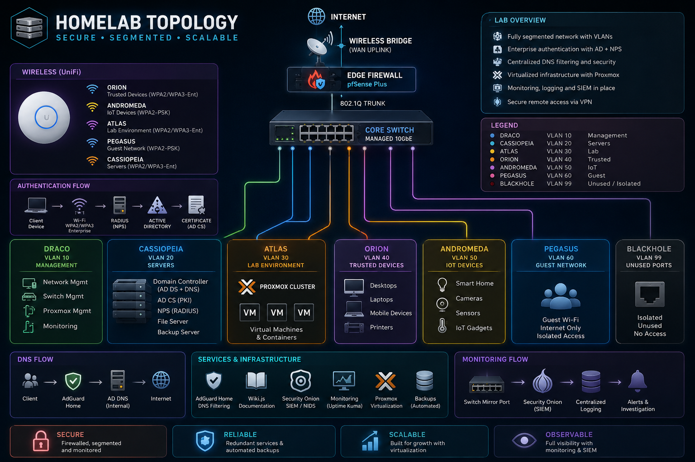

# Enterprise Network Segmentation

## Overview

This project documents the design and implementation of an enterprise-style segmented network built in a homelab environment using pfSense, Proxmox, Active Directory, and managed switching.

The objective was to improve security, reduce attack surface, separate device trust levels, and provide a scalable foundation for future infrastructure services.

---

## Goals

- Separate trusted and untrusted devices
- Create dedicated management network
- Implement firewall-based segmentation
- Support Active Directory infrastructure
- Prepare environment for Security Onion monitoring
- Improve troubleshooting and operational visibility

---

## VLAN Design

| VLAN | Name | Purpose |
|--------|--------|--------|
| 10 | Orion | Trusted Devices |
| 20 | Andromeda | IoT Devices |
| 30 | Atlas | Lab Environment |
| 40 | Pegasus | Guest Network |
| 50 | Cassiopeia | Servers |
| 99 | Draco | Management |
| 999 | Blackhole | Unused/Sink VLAN |

---

## Technologies Used

- pfSense Plus
- Proxmox VE
- Dell Precision 7810
- MokerLink Managed Switch
- Access Point
- Active Directory
- AdGuard Home
- VLANs
- DHCP
- DNS
- Firewall Rules

  
  
  
  

  
  
  

---

## Lessons Learned

- Importance of management plane separation
- Firewall rule ordering
- VLAN tagging and trunk configuration
- DNS architecture considerations
- Enterprise network design methodology

---

## Future Improvements

- Security Onion deployment
- Centralized logging
- WPA3 Enterprise
- Certificate-based authentication
- Network monitoring and alerting
